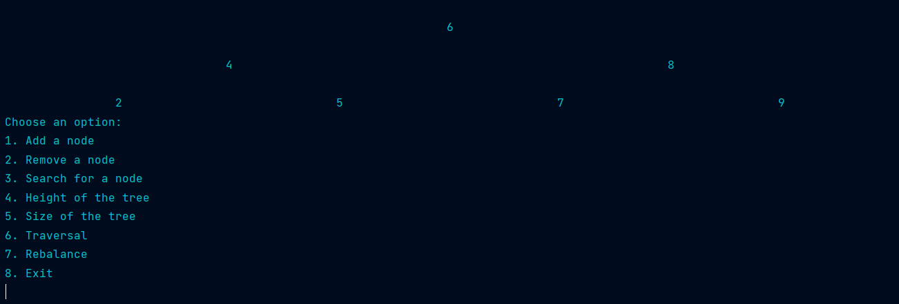

# Binary Search Tree Tool
This repository contains a tool used for generating and working with binary search trees, fully written in java. A binary search tree is a data structure that allows for efficient insertion, deletion, and retrieval of elements in a sorted order.
## Table of contents
- [Binary Search Tree Toolr](#binary-search-tree-tool)
  - [Table of Contents](#table-of-contents)
  - [About](#about)
  - [Installation](#installation)
  - [Usage](#usage)
  - [License](#license)

## About
A binary search tree (BST) is a rooted binary tree data structure with the key of each internal node being greater than all the keys in the respective node's left subtree and less than the ones in its right subtree. The time complexity of operations on the binary search tree is linear with respect to the height of the tree. Binary search trees allow binary search for fast lookup, addition, and removal of data items. Since the nodes in a BST are laid out so that each comparison skips about half of the remaining tree, the lookup performance is proportional to that of binary logarithm.

## Installation
To install the application simply clone the repository into your local machine.
```bash
git clone https://github.com/RyzhasMomentas/ADS1_ADS1_BinarySearch.git
```
compile the code and run src/main/java/org/example/Main.java application.

## Usage



Upon launching the application, the system will ask a user if they wish to create a new binary tree. If the user responds with a yes, the system will ask for a root node. Once the user has inserted the root node, the user will be presented with 7 different features: 
* Insertion: The system will add an element specified by the user to the tree
* Removal: The system will remove an element specified by the user from the tree
* Search: The system will verify if a specified element exists within the current tree
* Height: The system will calculate the height of the current tree
* Size: The system will calculate the size of the current tree
* Traversal: The system will return a sequence of elements in a requested order - Preorder, Inorder, Postorder, Levelorder
* Rebalance: The system will replace and the current tree with a balanced version of it

After each usage of a feature the system will print out a visual presentation of the tree so the user could keep track of the changes within it. Moreover it will ask the user if he wishes to use any other features.

## License
This project is licensed under the MIT License. You are free to use, modify, and distribute this code for your purposes.

